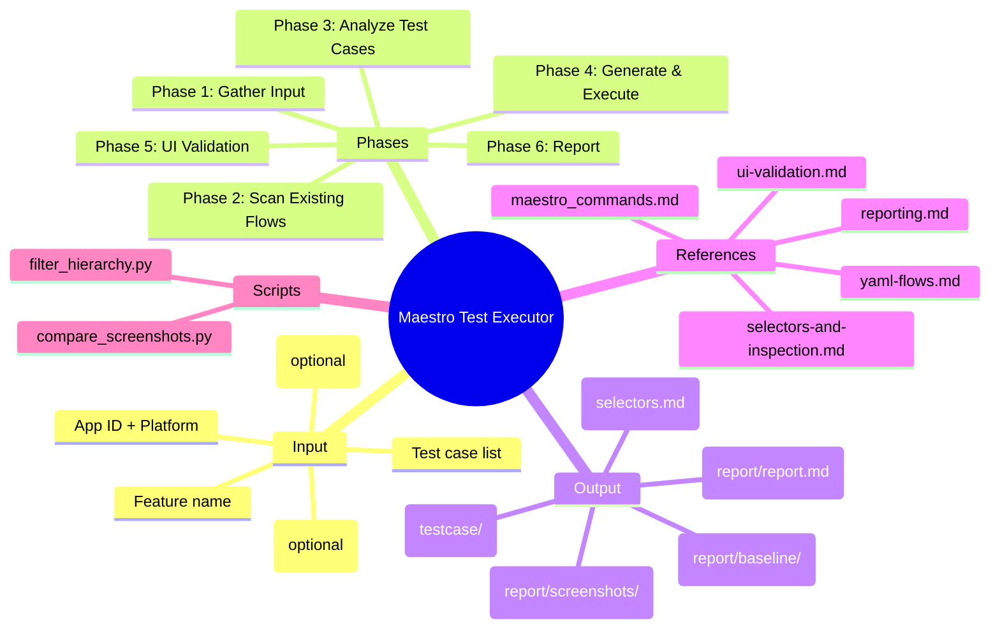
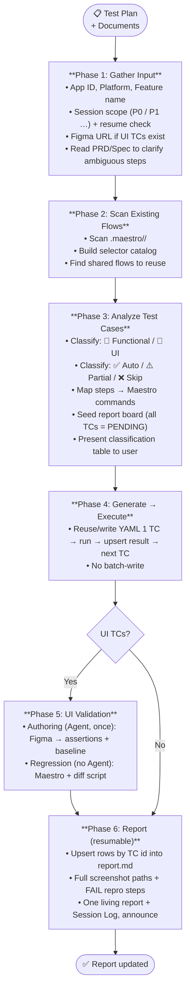
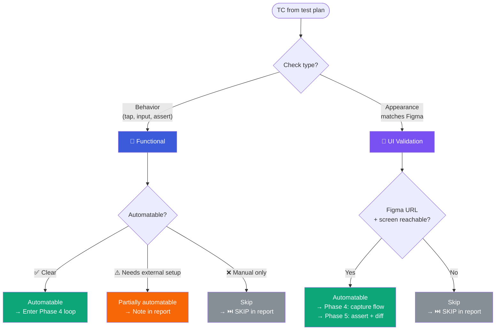
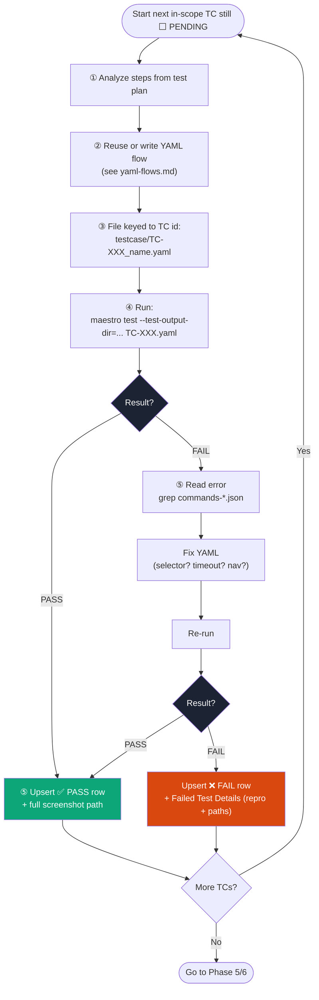
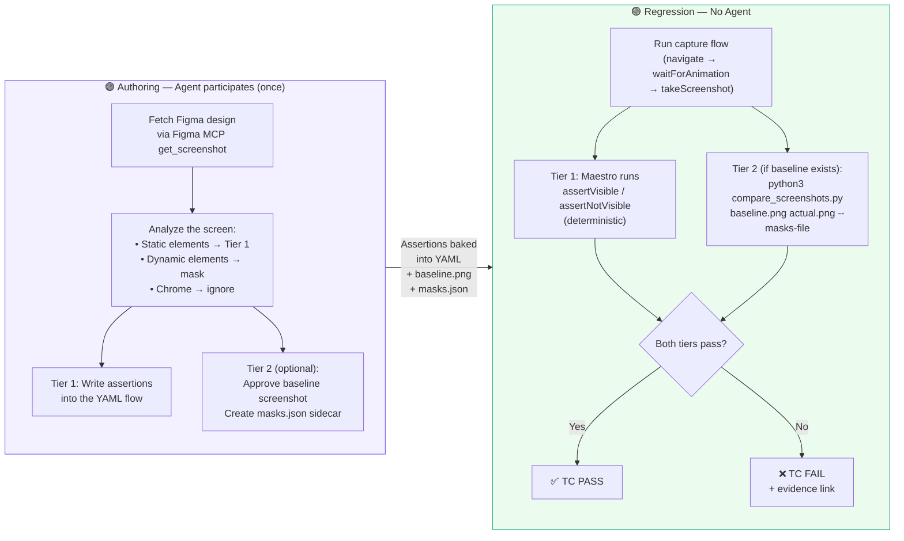
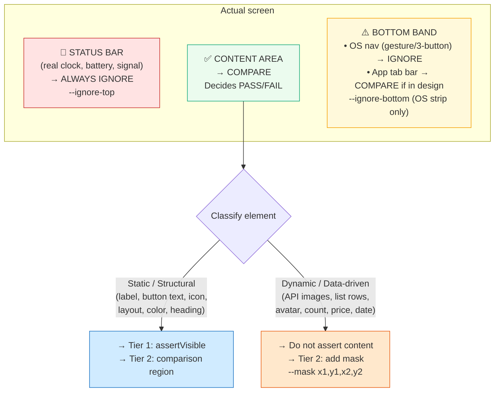
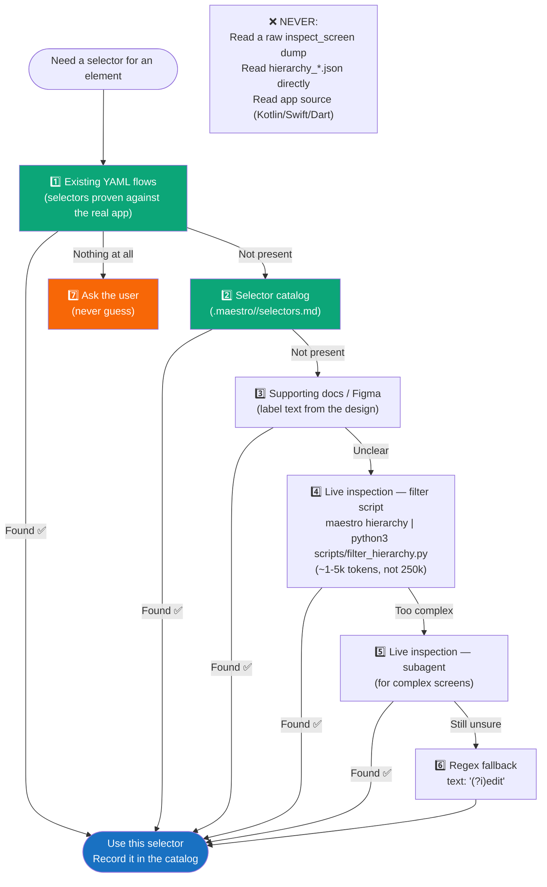
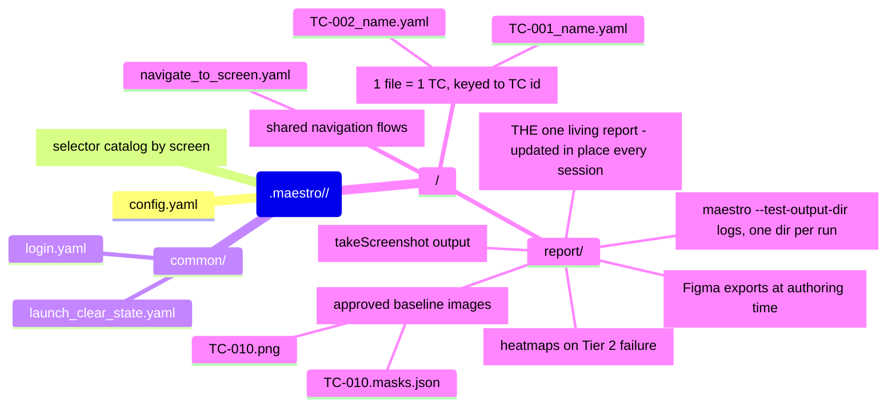
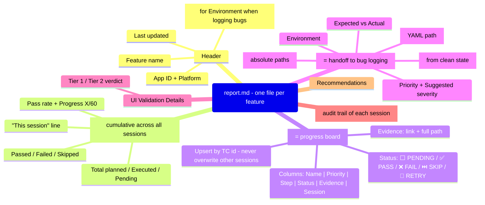
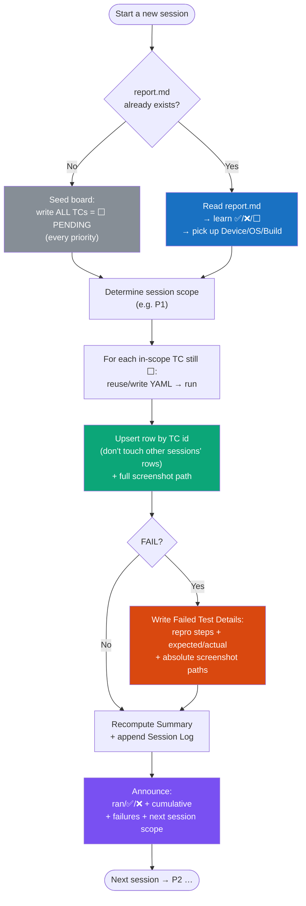

# Maestro Test Executor — Technical Documentation

> A skill that converts a QA test plan into Maestro YAML flows, runs each test case immediately, validates UI against the Figma design, and produces a consolidated report.
> Designed for QA testers — no source code reading required.

---

## 1. Overview — Mindmap

---

## 2. Main flow — 6 Phases

---

## 3. Test Case Classification

---

## 4. Phase 4 — Generate → Execute Loop

---

## 5. UI Validation — Two-tier model

> **Core principle:** the Agent participates **only once, at authoring time**. Every later regression run works with no Agent.

---

## 6. Three screen bands — UI comparison logic

---

## 7. Selector Resolution — Priority order

---

## 8. Directory structure

---

## 9. Report structure (one living, resumable file)

---

## 9b. Multi-session / Resume — running a large plan in priority slices

> A 60-case plan across P0→P4: each session runs one slice (S1=P0, S2=P1 …). One living report + one YAML per TC id, updated in place.

---

## 10. Reference Map

| Situation | Read file |
|-----------|-----------|
| Need an unknown selector | `references/selectors-and-inspection.md` |
| Write / fix a YAML flow | `references/yaml-flows.md` |
| Author a UI TC (Figma → assertions + baseline) | `references/ui-validation.md` |
| Produce / update the report, or resume a session | `references/reporting.md` |
| Find the right Maestro command | `references/maestro_commands.md` |
| Compress a hierarchy dump | `scripts/filter_hierarchy.py` |
| Run a visual baseline diff | `scripts/compare_screenshots.py` |

---

## 11. Key Anti-Patterns

| ❌ Avoid | ✅ Instead |
|---------|-----------|
| Read a raw `inspect_screen` dump | `filter_hierarchy.py` or a subagent |
| Write all YAML first, then run | 1 TC → run → fix → next TC |
| Hardcoded `sleep: 5000` | `waitForAnimationToEnd` / `extendedWaitUntil` |
| Read app source code | YAML flows + MCP inspect + docs |
| Agent in the regression loop | Tier 1 assertions + Tier 2 diff script |
| Flag status bar / API images as bugs | Mask chrome, don't assert dynamic content |
| Re-inspect the same screen repeatedly | Persist to `selectors.md`, read it back |
| Index-based selector | `id`, `testId`, or `text` |
| `--debug-output` | Always use `--test-output-dir` |
| A new timestamped report every session / overwriting the report | One living `report.md`, upsert rows by TC id |
| Duplicating YAML per session (`TC-017_v2.yaml`) | One YAML per TC id, edit in place, tag by priority |
| Screenshot path as bare filename / relative link | Absolute path in Failed Test Details |
| A FAIL row with only "element not found" | Failed Details: repro steps + expected/actual + path (foundation for bug logging) |
