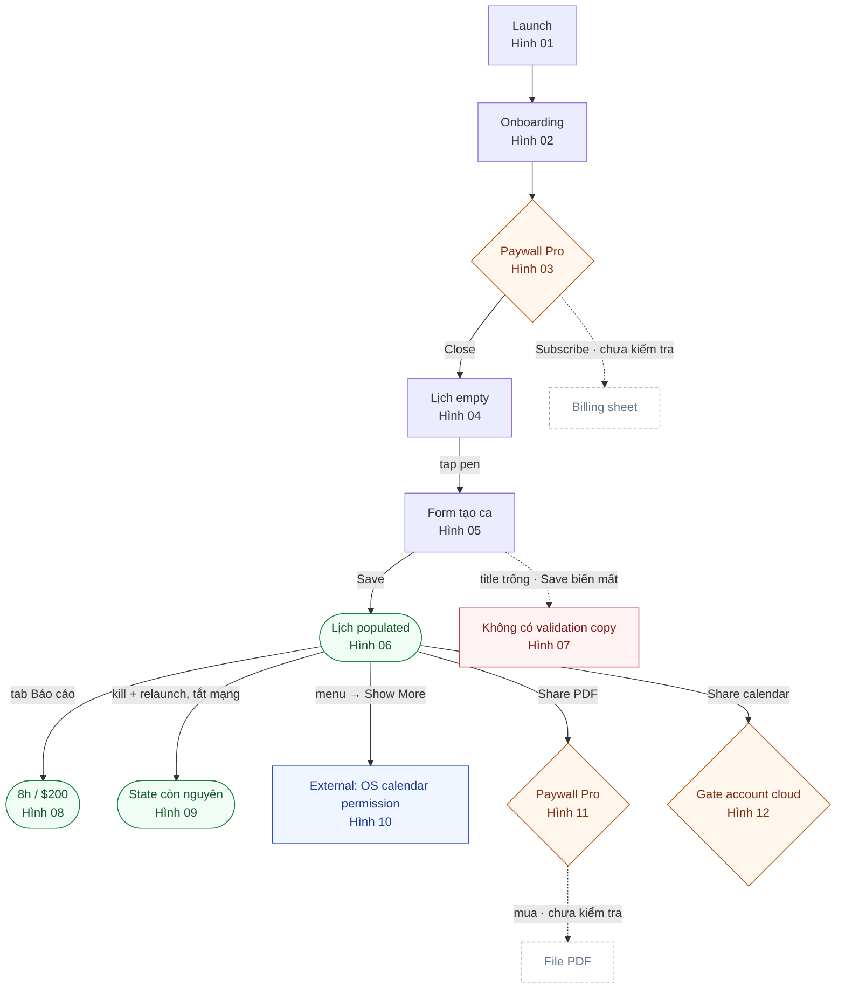

# DOCX Template — Mobile App Review Report (feature-first)

Tài liệu này là spec duy nhất để tạo báo cáo review app dưới dạng DOCX. Nó chứa: prompt cho agent, luật suy luận, quy trình suy luận từng bước, khuôn feature, luật ảnh, typography, QA. Không cần và không được lấy report của app khác làm mẫu — mọi quy tắc hình thức đã nằm trong file này.

Bốn nguyên tắc gốc:

- **DOCX là báo cáo feature.** Markdown trong `report/`, `flows/`, `analysis/` là working notes — chỗ được viết dài.
- **Mỗi feature trong Word = 1 câu job + 1 bảng 8 hàng + toàn bộ ảnh của feature + kết luận ngắn + đề xuất cải tiến.** Không tách 8–10 mục con.
- **Hình là trọng tâm, chữ là chú thích.** Ảnh xếp 2 cột, mỗi ảnh một caption rõ ràng ngay bên dưới.
- **Không claim quá evidence.** Đã xác minh / Suy luận có cơ sở / Chưa kiểm tra / Bị chặn phải phân biệt rõ.

---

## 1. Prompt cho agent

```text
Bạn là Mobile App Review Agent. Review [APP_NAME] trên [PLATFORM]
(package: [PACKAGE_ID]) và tạo DOCX tiếng Việt theo docx_template.md.

Mục tiêu DOCX
- Feature-first. Mỗi feature: một bảng 8 hàng (Screen ID, Route, Precondition,
  Chức năng, Monetization, Error, Edge case, Accessibility) + toàn bộ ảnh đã
  thu thập của feature xếp 2 cột, caption một dòng dưới mỗi ảnh + kết luận ngắn
  + 1–3 đề xuất cải tiến, mỗi đề xuất neo vào một quan sát đã có trong bảng/ảnh.
- Không lọc ảnh: ảnh nào có trong review tree của feature thì vào Word.
- Có một section phân tích metadata + ASO: bảng metadata có nguồn, bảng ASO
  theo hạng mục, bảng đối chiếu listing claim với runtime đã xác minh.
- Thứ tự feature xếp từ ngoài vào theo bậc thang ở Step 3 (launch → onboarding →
  home → core flow → feature phụ → dữ liệu → settings → nhánh rời app). Số Hình
  phải tăng đơn điệu theo thứ tự section; số Hình giảm là dấu hiệu section bị đảo.
- User Flow là một sơ đồ có node/edge/legend, chèn như một Hình, kèm bảng bước
  (Bước | Từ | Hành động | Tới | Kết quả | Hình). Không được rút gọn thành
  một dòng mũi tên.
- Control inventory, case matrix, data lifecycle, dump tree nằm ở working notes
  — không nhét vào Word.
- Phân biệt rõ đã xác minh / suy luận có cơ sở / chưa kiểm tra / bị chặn.
- Typography theo mục 8: 3 family, 6 cỡ, style thật trong DOCX.

An toàn
1. Không đọc .env, credentials, token, secret, key, database.
2. Không mua hàng, không Confirm IAP, không nhập payment.
3. Không click ad creative — chỉ đóng/back/collapse.
4. Không xóa account, clear data, logout, uninstall.
5. Không bịa quota, giá, permission, backend, model AI, retention.
6. Thiếu login: đánh "Bị chặn", hỏi account một lần lúc cuối.

Quy trình
1. Changelock + evidence ledger + app map.
2. Store research: đọc listing chính thức, ghi metadata + URL + ngày truy cập;
   tách store claim khỏi device observation.
3. Mỗi screen: screenshot entry, accessibility tree mới, action hợp lệ,
   screenshot after. Empty thì tạo data rồi chụp populated.
4. Core flow end-to-end với input hợp lệ. Camera: gallery/fixture nếu
   emulator không live được — ghi giới hạn.
5. Happy, variant, persist/relaunch, error/offline, một boundary khi an toàn.
6. Monetization: trigger, copy/giá verbatim; dừng trước payment sheet.
7. Viết working notes đầy đủ, rồi compile DOCX theo mục 4 (suy luận từng bước).

Đầu ra
- reviews/[slug]/[platform]/ README, 00-overview, report, flows, analysis, screenshots
- output/[SLUG]-[platform]-review-vi.docx

Nếu đã có working notes: bỏ bước khám phá, compile từ notes. Không re-explore.
```

---

## 2. Luật suy luận

Trước khi viết một claim, trả lời hết 5 câu. Một câu **không** → không được viết như fact.

```text
1. Tôi đã thấy điều này trên device, trong ảnh, trong tree, hoặc listing chính thức?
   Không → "Chưa kiểm tra" hoặc "Bị chặn". Dừng.

2. Evidence nào chứng đúng claim này (ảnh / thao tác / tree / URL)?
   Không chỉ được → hạ xuống "Suy luận có cơ sở" + ghi cái chưa biết.

3. Claim có đòi persist / quota / cloud / độ chính xác / "luôn"?
   Có mà chưa test đúng loại đó → không viết thành fact.

4. Đây có phải job user gọi tên?
   Không (shutter, crop, sheet con) → gộp vào feature cha.

5. Câu này có đang là inventory, toạ độ, hay case matrix?
   Có → để markdown. Word không chứa.
```

Dấu vết bắt buộc (không viết chain-of-thought dài trong Word):

```text
Bằng chứng → Quan sát → Diễn giải có biên → Kết luận → Mức tin cậy
```

| Nhãn | Dùng khi |
|---|---|
| `Đã xác minh` | Có output/state trên device hoặc nguồn chính thức |
| `Suy luận có cơ sở` | Có evidence gián tiếp; phải viết phần chưa biết |
| `Chưa kiểm tra` | Không chạy case |
| `Bị chặn` | Gate, quyền, emulator, thiếu account |
| `Không kết luận` | Evidence mâu thuẫn hoặc không đủ |

Ranh giới cứng:

- Store listing = `claim từ store`. Chỉ nâng thành runtime khi đã thấy trên device.
- Một screenshot chỉ chứng minh viewport đó. Persist cần ảnh sau relaunch.
- Mở được form ≠ flow works. Works = input hợp lệ đi tới output nhìn thấy, hoặc dừng đúng tại gate đã mô tả.
- Một thao tác thành công không chứng minh mọi biến thể input.

Cấm khi thiếu evidence: `chắc chắn`, `toàn bộ`, `luôn`, `không bao giờ`, `quota là…`, `AI model là…`, `dữ liệu lưu local` (nếu mới chỉ thấy còn sau relaunch).

| Không viết | Viết thay |
|---|---|
| Đã review toàn bộ app | Đã review [N] feature trong [scope]; chưa kiểm tra: … |
| Feature hoạt động tốt | Happy path [input] → [output] trong [context] |
| Không có bug | Không thấy lỗi ở case đã chạy; còn [gap] |
| Dữ liệu lưu local | Còn sau relaunch trên máy test; ownership chưa xác minh |
| AI chính xác | [n] input → [output]; chưa đủ mẫu để kết luận |

---

## 3. Cấu trúc DOCX

```text
1. Bìa + metadata
2. Phân tích metadata và ASO
3. Tóm tắt sản phẩm
4. User Flow đã xác minh   ← sơ đồ + bảng bước, không phải chuỗi mũi tên một dòng
5. Feature 1..N            ← trọng tâm, lặp cùng một khuôn
6. Tổng hợp UX / monetization / giới hạn
7. Findings ưu tiên (nếu có)
```

**Thứ tự section feature là thứ tự từ ngoài vào**: launch → first-run/onboarding → bề mặt chính → core flow → feature phụ → dữ liệu đã tạo → settings/account → nhánh rời app. Không xếp theo mức quan trọng, số ảnh, hay thứ tự thư mục screenshots. Bậc thang đầy đủ và cách tự kiểm ở Step 3.

**Cắt feature theo job user gọi tên** (Home, Scan, Lịch, Báo cáo, Hồ sơ), không theo từng file `report/<screen>/README.md`. Bước trong flow (camera view, crop, sheet con) không thành section riêng. Khoảng 5–12 feature. Số ảnh mỗi feature bằng số ảnh đã chụp được cho feature đó — core flow tự nhiên nhiều ảnh hơn tool phụ, không cắt bớt để cân bằng.

---

## 4. Quy trình suy luận từng bước

Mười ba bước, chạy đúng thứ tự. Mỗi bước có đầu vào, việc phải làm, và điều kiện xong. Không nhảy sang bước sau khi bước trước còn ô trống chưa gắn nhãn.

### Step 1 — Kiểm kê evidence

Đầu vào: thư mục `screenshots/`, working notes, changelock, evidence ledger, store research.

Làm:

1. Liệt kê **mọi** file ảnh, theo thư mục, theo thứ tự tên file.
2. Với từng ảnh, ghi một state duy nhất: `entry` / `empty` / `populated` / `form` / `after-action` / `menu` / `permission` / `gate-paywall` / `gate-ad` / `error` / `offline` / `external` / `after-relaunch`.
3. Ảnh không đọc được state thì mở notes để xác định. Không đoán từ tên file.
4. Ghi lại các thao tác đã chạy (input gì, kết quả gì) và các case **cố ý chưa chạy**.

Xong khi: mỗi ảnh có đúng một state, và có một list "chưa chạy" bằng chữ.

```text
Đúng: 04-calendar-permission.png → permission (OS surface, sau khi bấm Show More)
Sai:  04-calendar-permission.png → "màn hình quyền" (không rõ trigger, không rõ đây là surface ngoài app)
```

### Step 2 — Cắt feature theo job

Đầu vào: list ảnh + state ở Step 1.

Với mỗi screen ứng viên, hỏi ba câu:

```text
a. User có gọi tên nó như một việc muốn làm? (xem nhãn tab/menu/CTA trong app)
b. Nó có entry riêng từ navigation, không phải chỉ là bước giữa flow?
c. Nó có output riêng mà feature khác không tạo ra?
```

- Đủ ba → một feature, một section.
- Thiếu một → gộp vào feature cha (camera view, crop, collection selector, sheet xác nhận).
- Là surface của OS hoặc bên thứ ba (Photos picker, ad, payment sheet, permission dialog) → **không bao giờ** thành feature; nó là ảnh của feature đã gọi nó.

Xong khi: có bảng nháp `Feature | Screen ID | thư mục ảnh` và mọi ảnh ở Step 1 đã thuộc về đúng một feature.

### Step 3 — Xếp thứ tự feature từ ngoài vào

**Thứ tự khám phá không phải thứ tự báo cáo.** Agent có thể review Home trước rồi mới reset onboarding; báo cáo vẫn phải kể theo đường user đi từ ngoài vào.

Thứ tự section = thứ tự **user gặp feature khi cài mới và mở app lần đầu**. Xếp theo bậc thang cố định dưới đây, không xếp theo mức quan trọng, số ảnh, hay thứ tự thư mục.

| Lớp | Nội dung | Ví dụ |
|---|---|---|
| 0 | Launch trước khi có UI của app | splash, interstitial khởi động, chọn ngôn ngữ |
| 1 | First-run trước khi vào app | onboarding, permission mở màn, paywall first-run |
| 2 | Bề mặt chính sau khi vào app | Home / dashboard / lịch mặc định |
| 3 | Core flow — job chính gọi từ lớp 2 | scan, tạo bản ghi, tạo ca |
| 4 | Feature phụ gọi từ lớp 2 | các tool, tab thứ cấp |
| 5 | Dữ liệu đã tạo | collection, history, báo cáo |
| 6 | Cấu hình và tài khoản | Settings, Profile, membership |
| 7 | Nhánh rời app | share/export, integration, purchase branch |

Trong cùng một lớp: xếp theo thứ tự navigation của app — tab trái → phải, menu trên → xuống. Không xếp theo alphabet.

Làm:

1. Viết ra bảng thứ tự **trước khi** viết feature đầu tiên. Đây là artifact khoá thứ tự, giữ trong working notes:

| # | Feature | Lớp | Số bước từ Launch | Route đã đi |
|---|---|---|---|---|
| 1 | `[Onboarding]` | 1 | 1 | `Launch → Welcome` |
| 2 | `[Home]` | 2 | 2 | `Launch → onboarding → Home` |

2. **Kiểm tra phụ thuộc precondition:** nếu `Precondition` của feature A nhắc tới feature B (`onboarding xong`, `đã có ca`, `đã cấp quyền`), thì B phải có số nhỏ hơn A. Vi phạm ⇒ đổi chỗ, đừng sửa precondition cho khớp.
3. Feature không đi được từ lớp 2 mà chỉ tới từ một feature khác thì đứng ngay sau feature đó, không nhảy lên đầu.
4. App không có onboarding (hoặc vào thẳng returning-user state): ghi rõ một câu, và bắt đầu từ lớp 2. Không bịa ra một section onboarding rỗng.
5. Đặt tên thư mục ảnh trong working notes có tiền tố số theo lớp (`00-launch`, `01-onboarding`, `02-home`, `03-core`, …) để thứ tự alphabet trùng thứ tự flow. Đây là cách chặn lỗi ở gốc: sắp theo tên thư mục mặc định sẽ không còn đưa `home` lên trước `onboarding`.

Xong khi: có bảng thứ tự, mọi phụ thuộc precondition đi đúng chiều, và số section chạy 1..N theo bậc thang.

### Step 4 — Gán ảnh và số Hình

Làm:

0. Duyệt feature theo **đúng thứ tự đã chốt ở Step 3**, không theo thứ tự thư mục.
1. Trong mỗi feature, xếp ảnh theo **thứ tự flow đã đi**: `entry → form/action → state sau → menu/nhánh → gate → error/offline → after-relaunch`.
2. Ảnh dùng chung cho hai feature: đặt ở feature chính, feature còn lại nhắc bằng chữ trong hàng `Chức năng`. Không lặp ảnh.
3. Đánh số `Hình NN` chạy liên tục toàn tài liệu theo thứ tự xuất hiện, tính cả sơ đồ User Flow. Không reset theo feature.
4. Đếm: số ảnh trong Word phải bằng số ảnh trong thư mục của feature (trừ ảnh đã chuyển sang feature khác ở bước 2).

Xong khi: mọi ảnh có số Hình, phép đếm khớp, và **số Hình tăng đơn điệu theo thứ tự section**: Hình đầu của feature N+1 phải lớn hơn Hình cuối của feature N.

Đây là invariant tự phát hiện lỗi thứ tự. Nếu Home mang `Hình 04` mà lại đứng trước Onboarding mang `Hình 02`, số Hình sẽ giảm — dấu hiệu section bị đảo, quay lại Step 3.

### Step 5 — Điền 8 hàng

Mỗi ô 1–3 câu. Không bỏ hàng: thiếu thì `Chưa kiểm tra: …` hoặc `Không áp dụng: …` kèm lý do.

**Screen ID** — slug trùng changelock/notes, viết mono. Một feature một slug. Nếu feature gộp nhiều screen con, ghi slug cha, không liệt kê hết con.

**Route** — đường **đã đi thật** để tới feature, dạng chuỗi ngắn có mũi tên.

```text
Đúng: Launch → đóng paywall → tab Lịch
Sai:  Có thể vào từ Home, deep link, hoặc widget   ← chưa thử thì không viết
```

**Precondition** — state đã có **lúc chụp ảnh**: onboarding xong chưa, đã có data chưa, permission đã cấp chưa. Nếu review cả empty và populated thì ghi cả hai.

```text
Đúng: Onboarding xong. Empty lần đầu; populated sau khi tạo ca 09:00–17:00
Sai:  User thường đã có vài ca   ← giả định về user, không phải state đã chụp
```

**Chức năng** — gộp ba thứ mà notes tách rời: giá trị khởi tạo, default đáng kể, và trạng thái sau thao tác. Viết theo mạch `control đã bấm → cái nhìn thấy`. Persistence chỉ được viết ở đây nếu đã có ảnh sau relaunch; nếu không, đẩy sang `Edge case` dạng chưa test. Không thêm hàng thứ 9 cho persistence.

```text
Đúng: Pen FAB mở form tạo mới với giờ mặc định 09:00–17:00; lưu xong ca hiện trên
      month grid. Ca còn sau kill/relaunch.
Sai:  Bảng liệt kê 7 control kèm toạ độ và trạng thái enabled/disabled
```

**Monetization** — chỉ surface **trên feature này**. Ghi trigger + copy/giá đúng chữ + tác động (gate / optional / che UI). Đóng được thì không viết "bắt buộc mua". Listing ghi có ads mà chưa thấy creative → `chưa thấy trong state đã cover`.

```text
Đúng: Không thấy ad/paywall trên lịch local. Nút Share PDF → paywall Pro. Không hoàn tất purchase.
Sai:  App kiếm tiền bằng ads và subscription   ← đúng về sản phẩm, sai về surface này
```

**Error** — chỉ fail **đã xảy ra khi chạy**: message gì, có crash không, CTA có mất không, có retry không, có im lặng quay về không.

```text
Đúng: Để trống title thì không crash nhưng nút Save biến mất, không có copy validation
Sai:  Xử lý lỗi kém   ← đánh giá, không phải quan sát
Sai:  Có thể lỗi khi mất mạng   ← chưa chạy offline thì thuộc Edge case
```

**Edge case** — hai phần trong một ô: biến thể **đã thấy** (empty vs populated, offline, deny permission, repeat) **cộng** danh sách cố ý chưa chạy.

```text
Đúng: Đã thấy empty, populated, day overlay, permission. Chưa test: ca qua đêm,
      ca trùng giờ, nhiều ca một ngày, delete.
Sai:  Đã test đầy đủ các trường hợp
```

**Accessibility** — 1–2 insight dùng được: control icon-only không label, tree khác với ảnh, target quá nhỏ, ad chặn tap. Không dán dump tree.

```text
Đúng: Share và menu là icon-only, không có content description; bottom tabs có label trong tree
Sai:  [toàn bộ node tree]
```

Bảng đối chiếu nhanh — 8–10 mục dài trong notes gộp về đâu:

| Hàng Word | Lấy gì từ notes | Cắt gì |
|---|---|---|
| Screen ID | slug | — |
| Route | entry đã đi | deep link chưa thử |
| Precondition | state lúc chụp | giả định về user |
| Chức năng | mục đích + control đã bấm + default + output + persist đã chứng minh | inventory 5+ cột, toạ độ, default vụn |
| Monetization | trigger + copy/giá verbatim + impact | eCPM, experiment, suy luận doanh thu |
| Error | fail đã chạy | catalogue lỗi chưa chạy |
| Edge case | empty/populated + gap coverage | case matrix đầy đủ |
| Accessibility | 1–2 insight | dump tree, data lifecycle, permission table |

### Step 6 — Viết caption từng ảnh

Từ state đã gán ở Step 1, viết một dòng: tên trạng thái + một chi tiết phân biệt trong ngoặc. Chi tiết lấy từ cái nhìn thấy trong ảnh (tháng, số item, input, `sau ad`, `sau relaunch`, `chưa có data`), không lấy từ suy đoán.

Hai ảnh gần giống nhau thì caption phải khác nhau ở chi tiết trong ngoặc; nếu không phân biệt được thì một trong hai ảnh đang thiếu ngữ cảnh — quay lại notes.

Chi tiết định dạng ở mục 6.

### Step 7 — Viết kết luận feature

Ba dòng, không viết lại nội dung bảng:

1. `Đã xác minh` — 1–3 fact đã có ảnh/thao tác chứng minh.
2. `Suy luận / chưa kiểm tra / bị chặn` — bỏ dòng này nếu không có gì.
3. `Tin cậy` — Cao khi có happy path + ảnh (+ ảnh relaunch nếu đang claim persist); Trung bình khi mới thấy UI; Thấp khi dựa vào store claim hoặc một snapshot giá.

Luật hạ nhãn: claim lớn hơn test thì hạ, không sửa test cho vừa claim. `Còn sau relaunch` không được nâng thành `lưu local`. `Gate hiện ra` không được nâng thành `bắt buộc trả tiền`.

### Step 8 — Viết đề xuất cải tiến

Mỗi feature có 1–3 đề xuất. Đây là mục duy nhất trong báo cáo được phép nói "nên làm gì", nhưng vẫn bị neo vào evidence.

Luật:

1. **Mỗi đề xuất phải neo vào một quan sát đã có trong bảng 8 hàng hoặc trong ảnh của feature này.** Không có quan sát thì không có đề xuất.
2. Viết theo mạch: `[Quan sát đã có] → [Việc cụ thể nên làm] → [Điều user nhận được]`.
3. Không đề xuất tính năng chỉ vì app khác có. Không đề xuất giá, roadmap, business model, trừ khi có quan sát trực tiếp (ví dụ thấy hai mức giá khác nhau cho cùng gói).
4. Thứ chưa test **không** phải thứ thiếu — đó là gap coverage, viết ở `Edge case`, không biến thành đề xuất.
5. Không có gì để đề xuất thì ghi `Không có đề xuất từ những gì đã quan sát` — không bịa cho đủ mục.
6. Nói việc làm được, không nói cảm nhận. `Thêm inline validation "Nhập tên ca"` được; `Cải thiện UX form` không.

Thứ tự ưu tiên khi chọn 1–3 đề xuất:

```text
1. Chặn giá trị: gate/ad/permission đứng trước first value
2. Mất dữ liệu, lỗi im lặng, không có retry
3. Thiếu feedback/validation khiến user không biết vì sao thất bại
4. Accessibility: control icon-only không label, target nhỏ, tap bị chặn
5. Polish: copy, thứ tự, discoverability
```

Rubric ưu tiên (dùng đúng ba mức này, không tự thêm):

| Mức | Khi nào |
|---|---|
| Cao | Chặn giá trị cốt lõi, mất dữ liệu, hoặc thất bại không có thông báo |
| Trung bình | Friction lặp lại mỗi lần dùng, hoặc rào accessibility |
| Thấp | Copy, discoverability, polish |

### Step 9 — Phân tích metadata và ASO

Đầu vào: store listing chính thức (URL + ngày truy cập), trang App info trên device, landing page nếu có, và kết quả feature đã viết ở Step 5–8.

Làm:

1. Chép metadata **đúng chữ**: title, short description/subtitle, developer, package, category, content rating, version, size, ngày cập nhật, rating, số review, số lượt tải, cờ ads/IAP, danh sách locale.
2. Ghi nguồn cho từng trường: `listing chính thức` / `App info trên device` / `cache bên thứ ba`. Số liệu lệch giữa hai nguồn thì nêu cả hai kèm ngày, không tự chọn một số là đúng.
3. Đánh giá ASO theo hạng mục cố định (title, short description, long description, icon, screenshots, video, category, rating/review, tần suất update, localization). Mỗi nhận xét phải chỉ ra được chỗ nào trong listing dẫn tới nhận xét đó.
4. Đối chiếu **claim của listing với runtime đã xác minh** ở phần feature. Đây là giá trị lớn nhất của section này: chỗ listing hứa mà device chưa cho thấy phải hiện rõ.
5. Viết 1–3 đề xuất ASO, dùng đúng rubric ưu tiên ở Step 8.

Không được làm:

- Không bịa keyword ranking, search volume, conversion rate, vị trí top chart.
- Không suy luận thuật toán store hay lý do vì sao app được/không được đề xuất.
- Không đổi con số listing thành fact runtime (`1M+ downloads` là store signal, không phải chất lượng đã kiểm chứng).
- Không đánh giá icon/screenshot bằng cảm nhận thẩm mỹ. Chỉ nói điều kiểm được: ảnh đầu có nêu core value không, chữ trên ảnh có đọc được ở cỡ thumbnail không, thứ tự ảnh có kể đúng flow không.

Xong khi: mọi trường metadata có nguồn, mọi nhận xét ASO chỉ được về listing, và mọi claim của listing đã được gắn một trong bốn nhãn ở mục 2.

### Step 10 — Dựng User Flow

Đầu vào: state đã gán ở Step 1, thứ tự ảnh ở Step 4, hàng `Chức năng`/`Monetization`/`Error` của từng feature.

Làm:

1. Mỗi state đã quan sát → một node ứng viên. Bỏ node trùng (cùng screen, cùng state).
2. Với mỗi cặp node liền nhau, viết **hành động thật đã thực hiện** làm nhãn edge: `tap pen`, `Save`, `close paywall`, `Show More`, `kill + relaunch`, `tắt Wi‑Fi/mobile data`. Không có thao tác đã chạy thì **không có edge** — không nối hai node vì "chắc là đi được".
3. Gắn loại cho từng node: `state` (screen đã chụp), `gate` (paywall/ad/account/permission chặn đường), `external` (surface của OS hoặc bên thứ ba), `error` (fail/fallback đã xảy ra), `output` (kết quả nhìn thấy được hoặc state đã persist).
4. **Mỗi gate phải có tối thiểu hai nhánh:** nhánh đã đi (nhãn rõ) và nhánh chưa đi (nét đứt + `chưa kiểm tra`). Gate vẽ một nhánh là sai — nó biến lựa chọn thành đường thẳng.
5. Vẽ cả đường vòng lại (`back`, `close`, `collapse`) nếu đã thử.
6. Gắn số `Hình NN` lên node có ảnh, để người đọc nhảy từ sơ đồ sang hình.
7. Đếm chéo: mọi feature ở Step 2 phải xuất hiện ít nhất một node. Node không thuộc feature nào ⇒ Step 2 cắt sai, quay lại.
8. Quá 15 node thì tách: một overview flow (launch → core value → các nhánh chính) cộng sub-flow riêng cho feature phức tạp.
9. Kiểm tra cuối, đọc **ngược** từ node output về launch: mỗi bước phải chỉ được ra ảnh hoặc thao tác đã ghi. Bước nào không chỉ được thì xoá khỏi sơ đồ.

Không được:

- Không vẽ deep link, widget, notification tap nếu chưa thử.
- Không vẽ feature lấy từ mô tả store.
- Không vẽ node `success` khi flow thật dừng ở gate — node cuối phải là chính cái gate đó.
- Không gộp một gate thành mũi tên thẳng để sơ đồ trông liền mạch.
- Không ghi toạ độ tap trong sơ đồ.

Xong khi: mọi node có ảnh hoặc thao tác chống lưng, mọi edge có nhãn hành động, mọi gate có nhánh chưa kiểm tra được thể hiện, và có bảng bước đi kèm.

### Step 11 — Ghép các phần không phải feature

Viết **sau** khi toàn bộ feature đã xong, và **chỉ** được tổng hợp lại từ những gì feature đã xác minh. Không thêm fact mới ở bước này. Chi tiết từng phần ở mục 7.

### Step 12 — Áp typography và build

Áp hệ style ở mục 8 trước khi render. Style thật trong DOCX, không format tay từng run.

### Step 13 — QA

Chạy checklist mục 11. Bước tự kiểm quan trọng nhất: mở thư mục `screenshots/` của từng feature và đối chiếu với Word — thiếu ảnh nào là thiếu bằng chứng.

---

## 5. Khuôn một feature

```markdown
## [N]. [Tên feature]

[Một câu: job của feature này cho user.]

| Hạng mục | Mô tả ngắn |
|---|---|
| Screen ID | `[slug trùng changelock]` |
| Route | `[đường đã đi, không phải mọi đường có thể]` |
| Precondition | `[onboarding / login / đã có data / empty / permission]` |
| Chức năng | `[CTA đã bấm + default đáng kể + output đã thấy; persist chỉ nếu đã relaunch]` |
| Monetization | `[ad / paywall / quota / IAP trên ĐÚNG surface này / không thấy]` |
| Error | `[fail đã chạy: message, silent return, mất CTA, crash/không crash]` |
| Edge case | `[empty vs populated, offline, deny, repeat đã thấy] + [chưa test: …]` |
| Accessibility | `[thiếu label, icon-only, tree ≠ ảnh — không dump tree]` |

### Ảnh minh họa

[Toàn bộ ảnh của feature, 2 ảnh mỗi hàng, theo thứ tự flow đã đi.]

|  |  |
|---|---|
| Hình NN. [Trạng thái] ([chi tiết ngắn]) | Hình NN+1. [Trạng thái] ([chi tiết ngắn]) |
|  |  |
| Hình NN+2. [Trạng thái] ([chi tiết ngắn]) | Hình NN+3. [Trạng thái] ([chi tiết ngắn]) |

### Kết luận

- **Đã xác minh:** [1–3 fact]
- **Suy luận / chưa kiểm tra / bị chặn:** [bỏ dòng này nếu không có]
- **Tin cậy:** Cao | Trung bình | Thấp — [một câu lý do]

### Đề xuất cải tiến

| # | Quan sát | Đề xuất | Điều user nhận được | Ưu tiên |
|---|---|---|---|---|
| 1 | `[cái đã thấy trong bảng/ảnh]` | `[việc cụ thể nên làm]` | `[kết quả cho user]` | `[Cao/Trung bình/Thấp]` |
```

### Ví dụ đã điền

Ví dụ minh họa cho một app lịch ca. Số liệu và đường dẫn chỉ để thấy độ dài mong muốn của từng ô.

```markdown
## 5. Lịch ca

Month calendar là bề mặt tạo, xem ca và mở nhánh export/sharing.

| Hạng mục | Mô tả ngắn |
|---|---|
| Screen ID | `calendar` |
| Route | Launch → đóng paywall → tab Lịch |
| Precondition | Onboarding xong. Empty lần đầu; populated sau ca 09:00–17:00 |
| Chức năng | Pen FAB mở form tạo ca với giờ mặc định 09:00–17:00; lưu xong ca hiện trên month grid; top bar mở Share và menu (Jobs, Calendars, PDF). Ca còn sau kill/relaunch và sau khi tắt Wi‑Fi/mobile data |
| Monetization | Không thấy ad/paywall trên lịch local. Share PDF → paywall Pro. Calendar Sharing → gate yêu cầu account cloud |
| Error | Để trống title thì không crash nhưng Save biến mất, không có copy validation. Show More mở OS calendar permission, không thấy pre-explanation |
| Edge case | Đã thấy empty, populated, day overlay, menu, permission. Chưa test: ca qua đêm, ca trùng giờ, nhiều ca một ngày, delete |
| Accessibility | Share và menu là icon-only, không content description; bottom tabs có label trong tree |

### Ảnh minh họa

|  |  |
|---|---|
| Hình 04. Lịch empty với coach mark (tháng 8, chưa có ca) | Hình 05. Lịch populated (ca 9 AM trên grid) |
|  |  |
| Hình 06. Day selection overlay (chọn ngày 20) | Hình 07. Calendar menu (Jobs, Calendars, PDF/Print) |
|  |  |
| Hình 08. OS calendar permission (surface ngoài app, sau Show More) | Hình 09. Lịch sau kill/relaunch (ca vẫn còn) |

### Kết luận

- **Đã xác minh:** Tạo ca local → hiện trên month view → đọc lại được sau relaunch và sau khi tắt mạng.
- **Suy luận / chưa kiểm tra:** Local-first giảm friction, nhưng ownership/cloud sync chưa xác minh; delete chưa chạy.
- **Tin cậy:** Cao — có ảnh empty, populated và ảnh sau relaunch.

### Đề xuất cải tiến

| # | Quan sát | Đề xuất | Điều user nhận được | Ưu tiên |
|---|---|---|---|---|
| 1 | Title trống thì Save biến mất, không có copy validation (Hình 05) | Giữ nút Save ở trạng thái disabled kèm inline text `Nhập tên ca` | User biết vì sao chưa lưu được và sửa ngay trong form | Cao |
| 2 | Show More mở OS calendar permission mà không có giải thích trước (Hình 08) | Chèn một sheet ngắn nêu app cần quyền lịch để làm gì, trước khi gọi dialog OS | User quyết định cấp quyền khi đã hiểu lý do | Trung bình |
| 3 | Share và menu là icon-only, không content description | Thêm label/content description cho hai icon ở top bar | Screen reader đọc được; automation không phải tap theo toạ độ | Trung bình |
```

---

## 6. Ảnh — đầy đủ, 2 cột, caption rõ ràng

Người đọc hiểu feature bằng hình. Chữ chỉ chú thích.

### 6.1 Bộ ảnh đầy đủ

**Đưa hết ảnh đã thu thập của feature vào báo cáo.** Không lọc, không "chọn ảnh tiêu biểu". Ảnh có trong review tree mà không có trong Word là mất bằng chứng.

- Thứ tự = thứ tự flow đã đi: entry → action → state sau → gate/error → sau relaunch.
- Hai lần scroll của cùng một screen vẫn giữ cả hai; caption phân biệt `phần trên` / `sau khi scroll`.
- Ảnh dùng chung cho nhiều feature: đặt ở feature chính, feature còn lại nhắc bằng chữ, không lặp ảnh.
- Ảnh OS/external surface (Photos picker, ad, permission, payment sheet) vẫn vào; caption ghi rõ đây là surface ngoài app.
- Persist chỉ được claim khi trong bộ ảnh có ảnh **sau relaunch**.

Bố cục 2 cột nên số ảnh chẵn là gọn nhất; ảnh lẻ để trống cột phải, không kéo giãn cho đủ hàng.

Thứ tự cặp thường dùng khi xếp hàng: `empty | populated`, `entry | after-action`, `input | gate/result`, `happy | error`.

### 6.2 Caption

```text
Hình [NN]. [Tên trạng thái] ([một chi tiết ngắn])
```

Chi tiết trong ngoặc: tháng, số item, input, `sau ad`, `sau relaunch`, `chưa có data`.

Đúng:

```text
Hình 04. Lịch empty với coach mark (tháng 8, chưa có ca)
Hình 07. Báo cáo populated (tháng 8 có một ca)
Hình 12. Result gate (sau chọn ảnh, trước khi xem kết quả)
```

Sai:

```text
Hình 04. Lịch empty với coach mark. Source: screenshots/calendar/01-empty.png.
Context: first entry, chưa có ca. Captured: 2026-08-20, Pixel_7a emulator.
```

Không timestamp, không device, không Evidence ID trong caption — chỉ trạng thái và chi tiết phân biệt.

Source path: mặc định **không hiện** trong Word. Nếu cần audit đường dẫn, thêm dòng thứ hai trong cùng ô, style `EvidenceTag` (mono 8.5pt, màu Muted) — không bao giờ nhồi vào cùng dòng caption:

```text
Hình 04. Lịch empty với coach mark (tháng 8, chưa có ca)
screenshots/calendar/01-empty.png
```

### 6.3 Layout

- Bảng 2 cột, border rất nhạt hoặc không border; caption trong cùng ô, ngay dưới ảnh.
- Ảnh dọc giữ tỉ lệ; hai ảnh cùng hàng cùng chiều cao visual. Không kéo giãn.
- Ảnh lẻ: full-width hoặc để trống cột phải.
- Caption không rớt trang khỏi ảnh; heading feature không đứng cuối trang trước bảng.
- Số Hình tăng dần liên tục toàn tài liệu, không reset theo feature.
- Bảng ảnh nhiều hàng: mỗi hàng ảnh + hàng caption đi liền nhau, `cantSplit` để không cắt giữa trang.
- Sơ đồ User Flow: render PNG/SVG ≥ 2x, chiếm full-width, có legend, caption một dòng, và tính vào dãy số Hình.

---

## 7. Các phần không phải feature

### 7.1 Bìa + metadata

App, package, platform, device + resolution, ngày review, locale, coverage (`X feature / Y flow`), safety boundary (không purchase, không credentials, không delete).

### 7.2 Phân tích metadata và ASO

Ba bảng cố định, rồi tới đề xuất. Mọi giá trị chép đúng chữ từ listing; mọi nhận xét chỉ được về listing.

**Bảng 1 — Metadata**

| Trường | Giá trị | Nguồn |
|---|---|---|
| Title | `[đúng chữ trên listing]` | `[listing / device / cache]` |
| Short description \| Subtitle | `[đúng chữ]` | `[nguồn]` |
| Developer | `[tên]` | `[nguồn]` |
| Package / Bundle ID | `[id]` | `[nguồn]` |
| Category | `[category]` | `[nguồn]` |
| Content rating | `[rating]` | `[nguồn]` |
| Version | `[version]` | `[nguồn]` |
| Size | `[size]` | `[nguồn]` |
| Cập nhật lần cuối | `[ngày]` | `[nguồn]` |
| Rating / số review | `[4.8★ / 29.6K]` | `[nguồn]` |
| Lượt tải | `[1M+]` | `[nguồn]` |
| Ads / IAP | `[cờ trên listing]` | `[nguồn]` |
| Locale listing | `[danh sách hoặc số lượng]` | `[nguồn]` |

Ghi rõ URL và ngày truy cập bên dưới bảng. Số liệu lệch giữa hai nguồn thì để cả hai kèm ngày.

**Bảng 2 — ASO**

| Hạng mục | Quan sát | Nhận xét |
|---|---|---|
| Title | `[chữ + độ dài / giới hạn]` | `[có brand + job-to-be-done chưa]` |
| Short description / Subtitle | `[chữ + độ dài]` | `[có nêu core value chưa]` |
| Long description | `[cấu trúc, keyword lặp, có localize không]` | `[đọc được / nhồi keyword / thiếu core value]` |
| Icon | `[mô tả kiểm được: chữ trong icon, tương phản]` | `[nhận ra được ở cỡ thumbnail hay không]` |
| Screenshots | `[số ảnh, 3 ảnh đầu nói gì, có caption không]` | `[3 ảnh đầu có kể core value theo đúng flow không]` |
| Video preview | `[có / không]` | `[nếu core flow khó hiểu bằng ảnh tĩnh thì nêu]` |
| Category & content rating | `[giá trị]` | `[khớp với chức năng đã xác minh không]` |
| Rating & review | `[điểm, số review, ngày đọc]` | `[đây là store signal, không phải chất lượng đã kiểm chứng]` |
| Tần suất cập nhật | `[ngày update gần nhất]` | `[app còn được maintain hay không — chỉ theo ngày, không suy luận thêm]` |
| Localization | `[số locale listing vs ngôn ngữ thấy trong app]` | `[lệch chỗ nào]` |

**Bảng 3 — Listing claim đối chiếu runtime**

| Claim từ listing | Trạng thái | Ghi chú |
|---|---|---|
| `[đúng chữ claim]` | `Đã xác minh` / `Suy luận có cơ sở` / `Chưa kiểm tra` / `Bị chặn` | `[feature nào chứng minh, hoặc vì sao chưa]` |

**Đề xuất ASO** — 1–3 dòng, cùng khuôn và rubric ưu tiên như đề xuất feature:

| # | Quan sát | Đề xuất | Điều user nhận được | Ưu tiên |
|---|---|---|---|---|

### 7.3 Tóm tắt sản phẩm — nửa đến một trang

- Lời hứa store/UI → gắn `claim` nếu chưa chạy.
- Giá trị cốt lõi = input + output **đã chạy**.
- 2–4 điểm mạnh, 2–4 rủi ro — mỗi ý truy được về một feature đã viết.

Không nhét feature-map 7 cột nếu phần Feature đã phủ. Không mô tả flow ở đây — flow có section riêng ở 7.4.

### 7.4 User Flow đã xác minh

Một **sơ đồ** chèn như một Hình, cộng một **bảng bước** ngay dưới. Không được thay bằng chuỗi mũi tên một dòng: chuỗi text không thể hiện được gate hai nhánh, surface ngoài app, error, và nhánh chưa kiểm tra.

**Loại node và cách thể hiện**

| Loại | Hình dạng | Màu | Nghĩa |
|---|---|---|---|
| `state` | Chữ nhật | Rule border, nền trắng | Screen/state đã chụp |
| `gate` | Thoi | Nền `#FFF7ED`, viền `#B45309` | Paywall / ad / account / permission chặn đường |
| `external` | Chữ nhật viền đôi, nhãn `External` | Nền `#EFF6FF`, viền `#1D4ED8` | Surface của OS hoặc bên thứ ba |
| `error` | Chữ nhật | Nền `#FEF2F2`, viền `#B91C1C` | Fail / fallback đã xảy ra |
| `output` | Chữ nhật góc tròn | Nền `#F0FDF4`, viền `#15803D` | Kết quả nhìn thấy được hoặc state đã persist |
| `untested` | Nét đứt | Muted | Nhánh chưa kiểm tra |

Legend phải in kèm sơ đồ. Node có ảnh thì ghi `Hình NN` ở dòng thứ hai trong node.

**Nguồn sơ đồ — Mermaid, render ra PNG/SVG ≥ 2x rồi nhúng**



**Bảng bước — đi kèm sơ đồ, không thay thế nó**

| Bước | Từ | Hành động | Tới | Kết quả quan sát | Hình |
|---|---|---|---|---|---|
| 1 | Launch | mở app | Onboarding | `[cái nhìn thấy]` | Hình 01–02 |
| 2 | Paywall Pro | Close | Lịch empty | Vào được app không cần mua | Hình 03–04 |
| 3 | Lịch empty | tap pen → Save | Lịch populated | Ca hiện trên grid | Hình 05–06 |
| 4 | Lịch populated | kill + relaunch, tắt mạng | State còn nguyên | Ca vẫn đọc được | Hình 09 |
| 5 | Lịch populated | Share PDF | Paywall Pro | Dừng ở gate, không tạo file | Hình 11 |

Mỗi hàng của bảng phải khớp một edge trong sơ đồ. Edge có trong sơ đồ mà không có hàng nào tương ứng ⇒ một trong hai đang bịa.

**Tách sơ đồ khi quá lớn**

Quá 15 node thì làm một overview (launch → core value → tên các nhánh) và các sub-flow riêng cho feature phức tạp, mỗi sub-flow là một Hình riêng đặt trong section của feature đó.

### 7.5 Tổng hợp cuối

Một bảng `Điểm tốt | Rủi ro` (dedupe từ kết luận feature, không viết lại 8 hàng).
Một bảng monetization: `Surface | Trigger | Quan sát` (copy/giá verbatim).
Limitations: list những gì chưa test / bị chặn, kèm giới hạn môi trường (camera emulator, không account, không purchase, offline probe).

Đề xuất ưu tiên toàn app: gom các đề xuất `Cao` của mọi feature vào một list ngắn, giữ nguyên câu đã viết ở feature, không viết lại thành đề xuất mới.

### 7.6 Findings

Quan sát → tái hiện ngắn → impact user → chỗ nhìn thấy được. Không gán severity nếu không có rubric.

---

## 8. Typography — chia font theo vai trò

Quy tắc gốc: **văn xuôi = serif, cấu trúc/dữ liệu = sans, chữ lấy nguyên từ app = mono**. Ba family, sáu cỡ, không hơn.

### 8.1 Family

| Nhóm | Dùng cho | Stack (ưu tiên → fallback) |
|---|---|---|
| Sans | Bìa, heading, bảng, caption, header/footer, status tag | `Inter` → `Segoe UI` → `Helvetica Neue` → `Arial` |
| Serif | Câu job dưới heading, đoạn văn xuôi, kết luận | `Source Serif 4` → `Georgia` → `Times New Roman` |
| Mono | Copy/giá verbatim, path, screen ID, nhãn evidence | `JetBrains Mono` → `SF Mono` → `Consolas` → `Courier New` |

Không cài được font ưu tiên thì dùng bộ có sẵn trên cả macOS và Windows: `Arial` + `Georgia` + `Consolas`. Cả ba stack đủ dấu tiếng Việt, nhưng vẫn phải soi `ế ề ộ ữ ỹ ẩ ằ ỡ ị Đ` sau khi render.

### 8.2 Thang chữ (A4, lề 18mm)

| Style | Vai trò | Family | Size / Leading | Weight | Màu | Trước / Sau |
|---|---|---|---|---|---|---|
| `CoverTitle` | Tên app trên bìa | Sans | 30 / 34 | Bold | Ink | 0 / 8 |
| `CoverSubtitle` | Dòng định vị tài liệu | Sans | 12 / 17 | Medium | Muted | 0 / 6 |
| `CoverMeta` | Giá trị trong bảng metadata bìa | Mono | 9 / 13 | Regular | Body | 3 / 3 |
| `Heading1` | `[N]. Tên feature` | Sans | 17 / 21 | Bold | Ink | page break / 6 + rule 0.75pt |
| `FeatureLead` | Câu job một dòng dưới H1 | Serif | 10.5 / 15 | Italic | Muted | 2 / 10 |
| `Heading2` | `Ảnh minh họa`, `Kết luận`, `Đề xuất cải tiến` | Sans | 12 / 16 | Semibold | Ink | 12 / 5 |
| `Heading3` | Nhóm phụ trong phần tổng hợp | Sans | 10.5 / 14 | Semibold | Body | 9 / 4 |
| `Body` | Đoạn văn xuôi | Serif | 10.5 / 15 | Regular | Body | 0 / 6 |
| `BodyBullet` | Bullet kết luận | Serif | 10.5 / 15 | Regular | Body | 0 / 3, indent 6mm hanging 4mm |
| `TableHead` | Hàng đầu mọi bảng | Sans | 8.5 / 12 | Bold, caps, tracking +3% | White trên Ink | 3 / 3, repeat header |
| `TableLabel` | Cột `Hạng mục` (26% rộng) | Sans | 9 / 12.5 | Semibold | Ink | 3 / 3 |
| `TableCell` | Cột `Mô tả ngắn` (74% rộng) | Sans | 9 / 12.5 | Regular | Body | 3 / 3 |
| `FigureCaption` | Caption một dòng dưới ảnh | Sans | 8.5 / 12 | Regular, `Hình NN.` bold | Muted | 3 / 0, dính ảnh |
| `UIString` | Copy/giá/CTA verbatim, path | Mono | 8.5 | Regular | Ink, nền Shade |
| `EvidenceTag` | Path phụ dưới caption, mã evidence | Mono | 8.5 | Regular | Muted |
| `StatusTag` | `Đã xác minh`, `Chưa kiểm tra`, … | Sans | 8.5 | Bold, caps | theo 8.3 |
| `PageChrome` | Header, footer, số trang | Sans | 8.5 / 11 | Regular | Muted |

`UIString`, `EvidenceTag`, `StatusTag` là **character style** dùng trong dòng, không phải paragraph style.

### 8.3 Màu

| Token | Hex | Dùng |
|---|---|---|
| Ink | `#0B1220` | Heading, label cột 1, cover title |
| Body | `#1F2937` | Văn xuôi, ô bảng |
| Muted | `#64748B` | Caption, chrome, câu job |
| Rule | `#E2E8F0` | Border bảng, gạch dưới H1 |
| Shade | `#F1F5F9` | Nền `UIString`, zebra hàng bảng |
| Verified | `#15803D` | `Đã xác minh` |
| Inferred | `#B45309` | `Suy luận có cơ sở` |
| NotTested | `#64748B` | `Chưa kiểm tra` |
| Blocked | `#B91C1C` | `Bị chặn`, `Không kết luận` |

Bảng: border ngoài 0.75pt Rule, không kẻ dọc trong bảng 2 cột, zebra Shade chỉ khi bảng dài hơn 6 hàng.

### 8.4 Quy tắc

1. Ba nhóm không lẫn: câu do reviewer viết → serif; nhãn/dữ liệu/caption → sans; ký tự copy nguyên từ app → mono.
2. Đúng sáu cỡ: 30 / 17 / 12 / 10.5 / 9 / 8.5. Cần nhấn thì đổi weight hoặc màu, không sinh cỡ mới.
3. Không heading giả bằng body in đậm — heading phải là style thật để mục lục và PDF bookmark đúng.
4. Không gạch chân. ALL CAPS chỉ ở `TableHead` và `StatusTag`.
5. Không italic dưới 10pt cho tiếng Việt: dấu chồng nhau.
6. Giá, giờ, số liệu, exact CTA, path, ID → mono: `₫268,000`, `09:00–17:00`, `Scan For Free`.
7. Ô bảng quá 3 dòng ở 9pt thì **viết lại ngắn hơn**, không co font, không giảm leading.
8. Caption tràn dòng thì cắt chữ, không hạ size.
9. Một hệ font cho toàn tài liệu. Không đổi font/size để "làm feature này khác đi".

### 8.5 Cài đặt

DOCX (python-docx):

- Định nghĩa style thật trong `styles.xml`; không format từng run.
- `w:rFonts` phải set cả `ascii`, `hAnsi`, `cs`, `eastAsia` cùng tên. Thiếu `hAnsi` là nguyên nhân chữ có dấu nhảy về Times New Roman.
- `keepNext` cho `Heading1/2/3` và cho paragraph ảnh, để caption không rớt trang khỏi hình.
- `tblHeader` cho hàng đầu mọi bảng; `cantSplit` cho hàng chứa ảnh.
- Ba character style `UIString` / `EvidenceTag` / `StatusTag` khai báo một lần, dùng lại.

PDF (nếu xuất thêm bằng ReportLab):

- `pdfmetrics.registerFont` + `registerFontFamily` đủ regular / bold / italic / bold-italic. Thiếu biến thể thì bold bị synthesize và méo dấu.
- `ParagraphStyle` trùng tên style DOCX; `leading` lấy đúng cột Size / Leading ở 8.2.
- `TableStyle`: `FONTNAME` / `FONTSIZE` / `ROWBACKGROUNDS` theo 8.2–8.3, `repeatRows=1`.

---

## 9. Working notes vs Word

Giữ trong markdown (không paste vào Word): screen reading log, control inventory, case matrix (happy / variant / persist / error / boundary), data lifecycle, dump accessibility tree.

Khám phá khi chưa có notes: screenshot mới → tree mới → action → screenshot after. Empty thì tạo data rồi chụp populated. Core flow chạy end-to-end. Camera: gallery/fixture nếu emulator không live — ghi giới hạn.

Case không chạy vẫn ghi `not_tested` + lý do trong notes. Không bỏ row để coverage trông đẹp.

---

## 10. Định nghĩa done

Một feature là `done` trong DOCX khi có: 8 hàng không bịa, **toàn bộ ảnh đã thu thập của feature** kèm caption một dòng cho từng ảnh, kết luận có phân nhãn, và 1–3 đề xuất cải tiến neo vào quan sát (hoặc câu `Không có đề xuất từ những gì đã quan sát`).

Tài liệu là `done` khi mọi feature `done`, thứ tự section đi từ ngoài vào và số Hình tăng đơn điệu, section metadata & ASO có đủ ba bảng kèm nguồn, User Flow có sơ đồ + legend + bảng bước khớp nhau, tổng hợp không lặp lại bảng feature, số Hình liên tục không trùng, và QA mục 11 pass.

---

## 11. QA trước khi giao

Nội dung:

- [ ] Thứ tự section đi từ ngoài vào theo bậc thang Step 3; onboarding/first-run đứng trước bề mặt chính
- [ ] Số Hình tăng đơn điệu theo thứ tự section (Hình đầu của feature N+1 > Hình cuối của feature N)
- [ ] Feature nào là precondition của feature khác thì đứng trước feature đó
- [ ] Mỗi feature đúng khuôn: 1 câu job + 8 hàng + ảnh 2 cột + kết luận + đề xuất cải tiến
- [ ] Ô bảng 1–3 câu; không inventory / case matrix / toạ độ trong Word
- [ ] Observation tách khỏi inference; không từ tuyệt đối khi thiếu evidence
- [ ] Store claim không đội lốt runtime fact
- [ ] Monetization đúng surface; giá/copy verbatim
- [ ] Error = fail đã chạy; Edge case có cả phần chưa test
- [ ] Persist chỉ viết khi có ảnh sau relaunch
- [ ] User Flow là sơ đồ có legend + bảng bước, không phải chuỗi mũi tên một dòng
- [ ] Mọi edge có nhãn hành động thật; mọi node có ảnh hoặc thao tác chống lưng
- [ ] Mỗi gate có nhánh đã đi và nhánh chưa kiểm tra (nét đứt), không vẽ thành đường thẳng
- [ ] Node cuối của nhánh bị chặn là chính cái gate, không phải node success
- [ ] Mỗi hàng bảng bước khớp một edge trong sơ đồ và ngược lại
- [ ] Mọi feature xuất hiện ít nhất một node trong sơ đồ
- [ ] Mỗi đề xuất truy được về một quan sát trong bảng/ảnh của chính feature đó
- [ ] Đề xuất là việc làm được, không phải cảm nhận; ưu tiên đúng ba mức Cao/Trung bình/Thấp
- [ ] Không có đề xuất nào thực chất chỉ là gap coverage (thứ chưa test)

Metadata & ASO:

- [ ] Mọi trường metadata có nguồn (`listing` / `device` / `cache`) và ngày truy cập
- [ ] Số liệu lệch giữa hai nguồn được nêu cả hai, không tự chọn một số
- [ ] Nhận xét ASO chỉ được về chỗ cụ thể trong listing; không có keyword ranking / search volume / conversion bịa
- [ ] Con số listing (tải, rating) không bị dùng như fact runtime
- [ ] Mọi claim của listing đã gắn một trong bốn nhãn ở mục 2
- [ ] Có 1–3 đề xuất ASO theo đúng rubric ưu tiên

Ảnh:

- [ ] Đối chiếu thư mục screenshots của feature với Word: không ảnh nào bị bỏ sót
- [ ] Mỗi ảnh có đúng một caption ngay bên dưới; không ảnh nào trống caption
- [ ] Caption một dòng, không timestamp/device; thứ tự ảnh theo flow đã đi
- [ ] Số Hình duy nhất, tăng dần, không reset theo feature
- [ ] Ảnh không méo; ảnh lẻ không bị kéo giãn; hàng ảnh không bị cắt giữa trang

Font (mục 8):

- [ ] Serif cho văn xuôi, sans cho bảng/caption/heading, mono cho copy verbatim — không lẫn nhóm
- [ ] Chỉ sáu cỡ; không heading giả
- [ ] Dấu tiếng Việt đúng ở mọi style, kể cả `CoverTitle`, `TableHead` và mono
- [ ] Hàng đầu mọi bảng lặp khi tràn trang; không ô nào bị co font
- [ ] Header/footer cùng size, cùng màu Muted trên mọi trang

Visual: render toàn bộ trang và soi bìa, mỗi section, bảng dài, trang ảnh, trang cuối.

---

## 12. Handoff

```text
[APP] / [platform]: [N] feature, [X] ảnh, [M] findings.
DOCX: [path]
Điểm chính: [1–3 fact đã xác minh].
Giới hạn: [1–3 chưa test / bị chặn].
```
