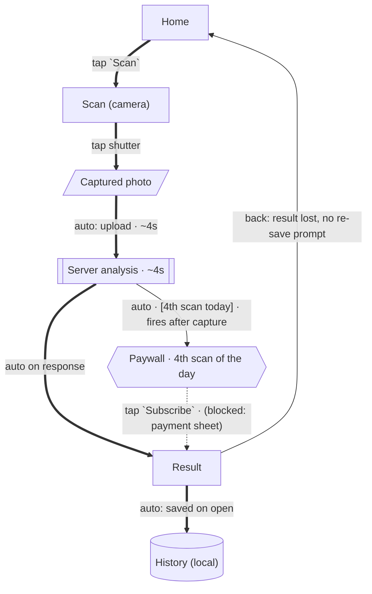

# Drawing the app's user flow

Read this when you're about to produce `analysis/ux-flows.md`, and skim the
[recording](#record-the-graph-while-you-explore) section *before* the screen loop —
the diagram is generated from transitions you record as you go, so recording has to
start early or you'll be drawing from memory at the end. Drawing from memory is how
diagrams end up with edges nobody ever traversed, and a wrong arrow is worse than a
missing one: the reader cannot tell them apart.

## Contents

- [What the diagram is for](#what-the-diagram-is-for)
- [Record the graph while you explore](#record-the-graph-while-you-explore)
- [Node taxonomy](#node-taxonomy)
- [Edges: the trigger is the label](#edges-the-trigger-is-the-label)
- [The three diagrams](#the-three-diagrams)
- [Generate, then annotate](#generate-then-annotate)
- [Keeping it readable](#keeping-it-readable)
- [When a flowchart is the wrong shape](#when-a-flowchart-is-the-wrong-shape)
- [Accuracy checklist](#accuracy-checklist)
- [Worked example](#worked-example)

---

## What the diagram is for

A screen report answers "what's on this screen". A flow report answers "what does
this feature do". Neither answers the question a PM or a designer opens the review
to ask: **how does a person get from launching this app to the thing it's for, and
what stands in the way?** That's a graph, and prose is a bad medium for a graph —
five paragraphs of "then you tap X, which opens Y" is something the reader has to
re-draw in their head, badly.

So the deliverable is a diagram, and the prose around it exists to carry what a
diagram can't: measurements, verbatim copy, and verdicts.

The thing that makes it worth reading is not the boxes — anyone can guess that a
scanner app has a Home and a Camera screen. It's the **annotations you can only get
by having run the app**: that the round-trip takes ~4 s, that the paywall fires
*after* the photo is captured rather than before, that the fourth arrow out of a
node exists at all. A diagram of node names alone is a sitemap, and you don't need
a device to draw a sitemap. Every edge should carry at least one thing you had to
be there to know.

## Record the graph while you explore

Every time the app moves from one thing to another and you saw it happen, record it:

```bash
python3 <skill-dir>/scripts/changelock.py add-edge --root <root> \
  --from home --to home/scan_plant \
  --trigger 'tap `Scan`' --kind tap --spine --flow scan-plant \
  --evidence screenshots/flows/scan-plant/01-camera.png
```

That is one line per transition, taken while the screenshot is still in front of
you, and it's the whole discipline. It costs seconds and it buys three things: the
diagram becomes generated rather than remembered, the graph survives a dead context
window along with everything else in the changelock, and every arrow arrives with
the screenshot that proves it.

Field by field, and what each one is protecting:

| Flag | Use it for |
|---|---|
| `--trigger` | The **literal** control or gesture: `tap \`Scan\``, `swipe left on a row`, `submit the form`. Not a paraphrase like "user proceeds" — a reader must be able to reproduce the step from the label alone. |
| `--kind` | `tap` `swipe` `input` `auto` `back` `deeplink` `system`. `auto` is the important one: a transition the app makes with no user action (a redirect after login, a timed splash, a result arriving) is a different fact from a tap and must not look like one. |
| `--status` | `observed` (you watched it), `inferred` (the UI implies it but you didn't traverse it), `blocked` (you tried and couldn't — login wall, payment sheet). Inferred and blocked render as dashed arrows labelled as such. |
| `--spine` | This edge is on the happy path. Spine edges render thick, so the main path is visible at a glance instead of buried among the branches. |
| `--flow` | The flow id, so `--scope flow` can pull just this flow's subgraph. |
| `--cost` | What the step costs a real user: `~4s`, `3 taps`, `2 form fields`. This is where time-to-first-value comes from later. |
| `--condition` | The app state that selects this branch: `4th scan of the day`, `not logged in`. A branch with no stated condition is a mystery to the reader. |
| `--evidence` | The screenshot showing the destination. An observed edge without evidence gets flagged by the linter, because it's indistinguishable from a guess. |
| `--tag journey` | Mark the first-run path so the journey diagram can be generated from it. |

Non-screen nodes have to be declared before you can point an edge at them:

```bash
python3 <skill-dir>/scripts/changelock.py add-node --root <root> \
  --id scan/analyzing --kind system --title "Server analysis (~4s)"
```

**Don't record every back arrow.** Back-to-parent is the default in every mobile
app; drawing all of them doubles the edge count and teaches the reader nothing. Add
a `--kind back` edge only where back does something *notable* — loses the result,
skips a step, exits the app, or lands somewhere other than where you came from.
That's a finding, and it deserves an arrow. `render-diagram --no-back` drops them
if the app-level map gets crowded.

## Node taxonomy

The shape tells the reader what kind of thing they're looking at without a legend
lookup. Use the kind that matches what the node *is*, not what it looks like:

| Kind | Shape | Use for |
|---|---|---|
| `screen` | rectangle | A real screen you can screenshot. Prefer the screen ids already in the changelock so the diagram and the reports agree. |
| `modal` | rounded | Dialog, bottom sheet, permission prompt, toast that blocks. |
| `input` | parallelogram | A step whose substance is data the user supplies: a captured photo, a typed query, a filled form. |
| `system` | subroutine | Work the app or its server does with no UI to inventory: an upload, a model call, a sync. Give it the measured duration in the title. |
| `decision` | diamond | A branch point the app resolves from state. Only use one if you **verified both branches**; otherwise it's a single edge with a `--condition`. |
| `gate` | hexagon | Paywall, login wall, quota limit, permission requirement. These are the nodes readers look for first. |
| `store` | cylinder | Where data lands: local DB, History list, the account. Makes the data lifecycle visible instead of implied. |
| `terminal` | stadium | Entry (`App launch`, `deep link`, `push notification`) and exit points. |
| `external` | trapezoid | Leaves the app: browser, OS payment sheet, another app, share sheet. |

One node = one screen **signature**, not one screenshot. Home before and after a
scan is the same node; if the difference matters, say so on the edge or in the
prose. Conversely, a screen that behaves like two different things depending on
state (empty History vs populated History) is worth two nodes only if the reader
needs to see two sets of outgoing edges — usually they do, and that's exactly the
finding an empty-list-only report misses.

## Edges: the trigger is the label

An arrow with no label is an assertion that something happens, with no account of
how. Every edge label answers "what did you do, and what did it cost":

```
Home ==>|"tap `Scan` · ~4s"| Camera
Result -->|"tap `Save` · [logged in]"| History
Camera -.->|"tap `Import` · (inferred, not tested)"| Gallery
```

Three rules that keep labels honest:

1. **Verbatim UI copy, in backticks.** `tap \`Bắt đầu\`` — not "tap Start". The
   reader is going to look for that string on their own screen.
2. **Dashed means not proven.** Never promote an inferred edge to solid because it
   "obviously" works. The dashes are the reader's cue about which parts of the map
   they can trust, and they're the most valuable thing in the diagram.
3. **Numbers where you measured them, nothing where you didn't.** An unmeasured
   edge with no cost annotation is fine; an invented `~2s` is a fabricated finding.

## The three diagrams

`analysis/ux-flows.md` holds three, in this order, because they answer three
different questions and cramming them into one graph makes all three unreadable.

**1. App map** (`--scope app`, left-to-right). Every documented screen and the
transitions between them: the navigation shape of the whole app. This is the one
the user means by "vẽ workflow của cả app". It answers "how big is this app and how
is it wired". Keep it structural — the detail lives in the other two.

**2. Flow diagrams** (`--scope flow --flow <id>`, top-down, one per registered
flow, core first). The subgraph of a single flow with its branches: the happy path
as a thick spine, then the error, boundary and abuse branches off it, with the
gates where they actually fire. This is where the case matrix from the flow report
becomes visible as a shape, and it's the diagram that shows things like a paywall
firing after the work is done rather than before.

**3. First-run journey** (`--scope journey`, top-down, from edges tagged
`journey`). Cold install → onboarding → first real value → the upgrade prompt, with
`--cost` on every edge so the reader can add up time-to-first-value and count the
taps and permission prompts standing between install and payoff. Tag these edges
during the overview pass, when you're the only person who will ever see this app
for the first time — that state is unrecoverable once you've used it for an hour.

## Generate, then annotate

Generate each diagram into the report between marker comments, then write prose
around it. The markers let you re-render after finding more edges without losing
what you wrote:

```bash
python3 <skill-dir>/scripts/changelock.py render-diagram --root <root> \
  --scope app --inject analysis/ux-flows.md
python3 <skill-dir>/scripts/changelock.py render-diagram --root <root> \
  --scope flow --flow scan-plant --inject analysis/ux-flows.md
```

Each render prints a lint report to stderr: edges pointing at unregistered nodes,
observed edges with no screenshot, nodes with no way in, documented screens absent
from the graph. Work through those before you publish — they're the specific ways
this diagram can mislead someone, listed for you. `--strict` makes them fatal if
you want the check to be unmissable.

Hand-editing the generated Mermaid is a trap: the next render overwrites it and the
graph in the changelock stays wrong. If the diagram is wrong, the recorded edge is
wrong — fix it with `add-edge` (re-recording the same from/to/trigger updates it in
place) and render again.

`assets/user-flow-template.md` has the full structure with the markers already in
place, plus the prose sections that make the diagrams useful:

- **Time to first value** — cold install to first real output, in seconds and taps
- **The core loop** — the repeat cost once onboarding is done
- **Gates** — every hexagon in the diagrams, with what triggers it and whether it
  fires before or after the user does the work
- **Friction and dead ends** — where you got stuck, backed out, or had to guess
- **Unmapped** — the dashed edges and blocked branches, named honestly

## Keeping it readable

Mermaid renders anything; a human can only read so much. Practical limits:

- **~20 nodes per diagram.** Past that, split by feature cluster into subgraphs, or
  collapse a whole area into one node (`Settings (8 screens)`) and link to the
  screen report. A diagram nobody can follow has the same value as no diagram.
- **`LR` for the app map, `TD` for flows.** Navigation is broad and shallow, flows
  are long and narrow; matching the direction to the shape avoids the tangle.
- **Subgraphs for clusters**, not for decoration: `subgraph onboarding` earns its
  keep when it lets the reader skip a region.
- **Don't style individual nodes by hand.** The generator assigns a class per node
  kind, which is what keeps the same shape meaning the same thing across every
  diagram in the review.

Syntax gotchas that break rendering, all handled by the generator — worth knowing
if you write Mermaid by hand anyway: labels must be quoted when they contain
punctuation (`(`, `:`, `#`, `-`); `"` inside a label needs `&quot;`; line breaks are
`<br/>`; node ids must be alphanumeric plus underscore, so `home/scan` can't be an
id (the generator maps it to `n_home_scan`).

## When a flowchart is the wrong shape

Reach for a different diagram type when the thing you're documenting isn't
navigation:

- **`stateDiagram-v2`** for one object's lifecycle across states: a subscription
  (trial → active → expired → cancelled), a download, a scan result being edited,
  saved, deleted. Use it when the interesting facts are the states and the
  transitions between them rather than the screens.
- **`sequenceDiagram`** for who-talks-to-whom over time: app ↔ server ↔ payment
  provider, or an offline queue that syncs later. Use it when timing and the split
  between local and server work is the finding — often the clearest way to show
  what happens in airplane mode.
- **A table** when there are no arrows worth drawing. Four independent settings
  screens are a table, not a graph. Don't inflate a list into a diagram.

Put these next to the flow they explain, not in the app map.

## Accuracy checklist

Run through this before the diagram section is done. Each line is a way a diagram
lies that no reader can detect:

- [ ] Every solid arrow is a transition you personally traversed, with a screenshot
- [ ] Every arrow you did *not* traverse is dashed and labelled `inferred` or `blocked`
- [ ] Every edge label is the literal control's copy, not a paraphrase
- [ ] Every `auto` edge really has no user action (check your screenshots, not memory)
- [ ] Every diamond has both branches verified; the rest are conditions on an edge
- [ ] Every gate node says what triggers it and *when* it fires relative to the work
- [ ] Node count matches reality: documented screens absent from the graph are
      listed in the lint output and either added or explained
- [ ] No node is unreachable, and dead ends are real dead ends rather than untested steps
- [ ] Costs (`~4s`, `3 taps`) come from something you timed or counted
- [ ] The Mermaid block renders (no unquoted punctuation, no bare ids with `/`)
- [ ] Language follows the report language, but UI copy stays verbatim

## Worked example

A scan app, after the core flow and six screens. Note what the diagram carries that
the screen reports can't: the ~4 s server round-trip as its own node, the paywall
firing *after* capture, the non-obvious back behaviour, and one honest dashed edge.

````markdown
<!-- flow-diagram:flow-scan-plant -->

<!-- /flow-diagram:flow-scan-plant -->

**Reading it:** the free-tier limit is enforced *after* the photo is captured and
uploaded, so a blocked user has already spent the effort and the app has already
spent the bandwidth. The result is saved on open rather than on a `Save` tap —
there is no way to discard a scan except deleting it from History afterwards.
````

The thick spine is four steps and ~6 s from Home to a saved result. That sentence,
plus the two the diagram makes obvious, is the whole point of the section.
